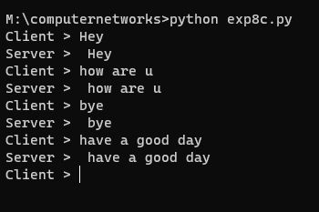

# EX-8 APPLICATION USING TCP SOCKETS - CREATING ECHO CLIENT-SERVER

# DATE : 27.04.2023

# AIM :
### To write a python program for creating Echo Client and Echo Server using TCP Sockets Links.


# ALGORITHM :

### Start the program.
### Get the frame size from the user
### To create the frame based on the user request.
### To send frames to server from the client side.
### If your frames reach the server, it will send ACK signal to client otherwise it will send NACKsignal to client.
### Stop the program.


# CLIENT PROGRAM :
```python 3
## Developed By : SOUVIK KUNDU
## Reg no : 212221230105
import socket

s = socket.socket()
s.connect(('localhost', 8000))

while True:
    msg = input("Client > ")
    s.send(msg.encode())
    print("Server > ", s.recv(1024).decode())

```
# SERVER PROGRAM :
```py
import socket

s = socket.socket()
s.bind(('localhost', 8000))
s.listen(5)
c, addr = s.accept()

while True:
    ClientMessage = c.recv(1024).decode()
    c.send(ClientMessage.encode())

```

#  SERVER OUTPUT :

# CLIENT OUTPUT :


# RESULT :
### Thus, the python program for creating Echo Client and Echo Server using TCP Sockets Links was successfully created and executed.